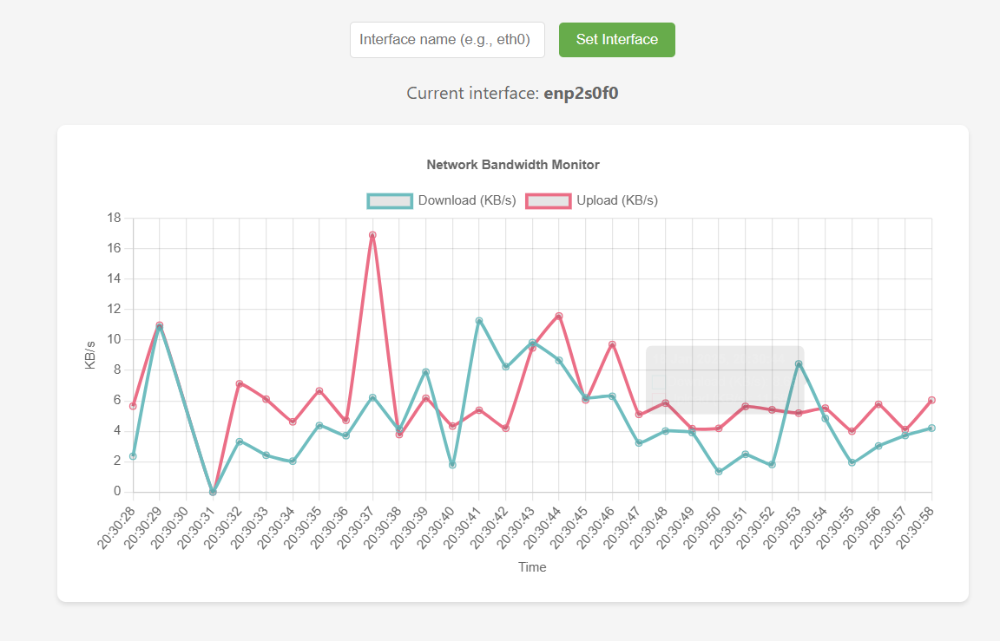

# Network Bandwidth Monitor

A real-time network bandwidth monitor that displays upload and download speeds using modern JavaScript and Chart.js.



## Features

- Real-time bandwidth monitoring with separate upload and download speeds
- Automatic network interface detection
- Manual interface selection option
- Playback controls (play/pause)
- Modern, responsive UI with smooth time-series chart
- Cross-platform support (Linux, macOS, FreeBSD)
- No external dependencies beyond PHP and a web server

## Requirements

- PHP 7.0 or higher
- Web server (Apache, Nginx, etc.)
- Read access to network interface statistics
  - Linux: `/sys/class/net/*/statistics/`
  - macOS/FreeBSD: `netstat` command
- Modern web browser with JavaScript enabled

## Installation

1. Clone the repository:
   ```bash
   git clone https://github.com/mrevjd/network-bandwidth-monitor.git
   ```

2. Place the files in your web server's directory
3. Ensure PHP has permissions to read network interface statistics
4. Access through your web browser (e.g., `http://localhost/network-bandwidth-monitor`)

## Usage

- The monitor will automatically detect and use your default network interface
- To monitor a specific interface:
  - Use the interface selection form at the top of the page
  - Or append `?interface=INTERFACE_NAME` to the URL (e.g., `?interface=eth0`)
- Use the playback controls to:
  - Pause the monitoring while preserving the graph
  - Resume monitoring from where you left off

## Credits

Originally developed by Andreas Beder and Nikola Petkanski.
Modernized version uses:
- Chart.js for visualization
- Luxon for time handling
- Modern JavaScript features

## License

This project is licensed under the MIT License - see the LICENSE file for details.
